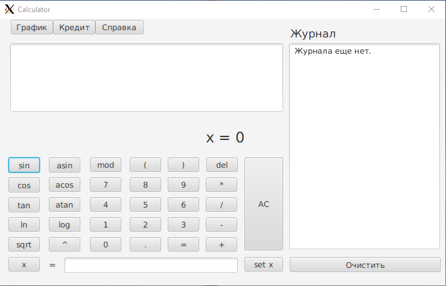
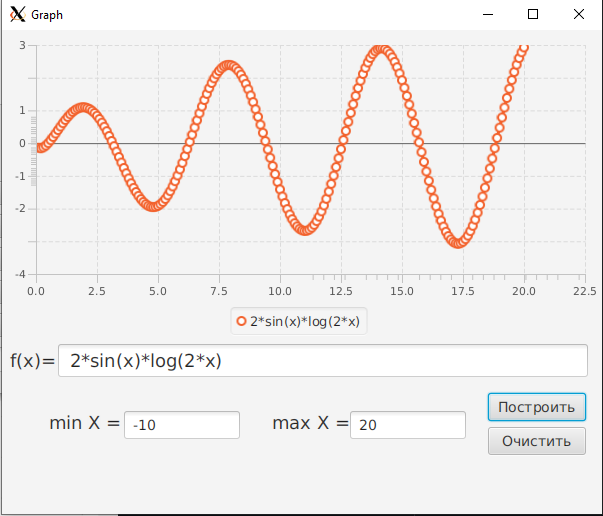
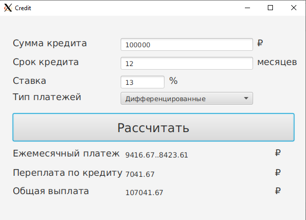

<!DOCTYPE html>
<html>

<body>
    <h1>Руководство SmartCalcV3.</h1>
    <h2>Содержание</h2>
    <ol>
        <li><a name="5" href="#5-1">Сборка</a></li>
        <li><a name="1" href="#1-1">Установка</a></li>
        <li><a name="2" href="#2-2">Запуск калькулятора</a></li>
        <li><a name="4" href="#4-4">Описание SmartCalcV3</a>
            

                <ol>
                    <li><a name="4.1" href="#4-4-1">Калькулятор</a></li>
                    <li><a name="4.2" href="#4-4-2">Построение графиков</a></li>
                    <li><a name="4.3" href="#4-4-3">Кредитный калькулятор</a></li>
                </ol>
            

        </li>
    </ol>
    <h2>Сборка</h2>
    
Для корректной сборки установщика сначала нужно скопироать нативную библиотеку (libMainModel.so) из диреткория native в java.library.path, например в /usr/lib. Для корневой директории команда выглядит следующим образом:

    
(Эта команда нужна для корректной отработки тестов)

    <pre>sudo cp src/main/native/libMainModel.so /usr/lib/</pre>
    
Далее нужно перейти в корневую папку и выполнить команду

    <pre>mvn clean install</pre>
    
Установщик будет находиться в target/installer и называться <b>smartcalcv3_1.0.0-1_amd64.deb</b>

    <h2>Установка</h2>
    
Чтобы установить калькулятор перейдите в терминале в корневую папку проекта и выполните команду:

    <pre>sudo dpkg -i target/installer/smartcalcv3_1.0.0-1_amd64.deb</pre>
    
В папке /opt создастя директория smartcalcv3 калькулятора, а сам исполняемый файл будет находиться в smartcalcv3/bin/ и называться <b>SmartCalcV3</b>

    <h2>Запуск калькулятора</h2>
    
Сначала для корректной работы калькулятора нужно прописать команду:

    <pre>export LD_LIBRARY_PATH=/opt/smartcalcv3/lib/app:$LD_LIBRARY_PATH</pre>
    
Затем для использования/запуска калькулятора перейдите в терминале в папку smartcalcv3/bin/ и выполните команду:

    <pre>./SmartCalcV3</pre>
    <h2>Описание SmartCalcv3</h2>
    <ul>
        <li>Калькулятор
            
При запуске калькулятора открывается главное окно - собственно калькулятор:

            
            <ul>
                <li>Калькулятор позволяет проводить арифметические операции с различными операторами (сложение,
                    вычитание, умножение, деление, остаток от деления, возведение в степень) и функциями (см. далее).
                </li>
                <li>В приложении реализован раздел справки с описанием интерфейса программы</li>
                <li>Программа хранит историю операций, позволяет загружать выражения из истории и очищать историю целиком. История  сохраняется между запусками приложения.</li>
                <li>Модель калькулятора представляет собой «Ядро» на с++ с оберткой на Java</li>
                <li>На вход программы могут подаваться как целые числа, так и вещественные числа, записанные через
                    точку.</li>
                <li>Представляется возможность вводить выражение напрямую с клавиатуры.</li>
                <li>Производится вычисление произвольных скобочных арифметических выражений в инфиксной нотации
                </li>
                <li>Вычисление производятся после полного ввода вычисляемого выражения и нажатия на символ `=`.</li>
                <li>Предоставляется лимит выражения в 256 символов</li>
                <li>Функции:
                    <table>
                        <tr>
                            <th>Описание функции</th>
                            <th>Функция</th>
                        </tr>
                        <tr>
                            <td>Вычисляет косинус </td>
                            <td>cos(x)</td>
                        </tr>
                        <tr>
                            <td>Вычисляет синус </td>
                            <td>sin(x)</td>
                        </tr>
                        <tr>
                            <td>Вычисляет тангенс </td>
                            <td>tan(x)</td>
                        </tr>
                        <tr>
                            <td>Вычисляет арккосинус </td>
                            <td>acos(x)</td>
                        </tr>
                        <tr>
                            <td>Вычисляет арксинус </td>
                            <td>asin(x)</td>
                        </tr>
                        <tr>
                            <td>Вычисляет арктангенс </td>
                            <td>atan(x)</td>
                        </tr>
                        <tr>
                            <td>Вычисляет квадратный корень </td>
                            <td>sqrt(x)</td>
                        </tr>
                        <tr>
                            <td>Вычисляет натуральный логарифм </td>
                            <td>ln(x)</td>
                        </tr>
                        <tr>
                            <td>Вычисляет десятичный логарифм </td>
                            <td>log(x)</td>
                        </tr>
                    </table>
                </li>
            </ul>
        </li>
        <li>Построение графиков
            
Чтобы перейти в окно построения графиков нужно нажать на соответствующую кнопку в главном окне (окне калькулятора).
  
Откроется следующее окно:

            
            
Доступен следующий функционал:

            <ul>
                <li>Построение графика функции, заданной с помощью выражения в инфиксной нотации с переменной <b>x</b>.
                </li>
                <li> Построение графика, заданного с помощью выражения в инфиксной нотации без переменной (будет прямая)</li>
                <li>Задание области определения в диапазонах от -1000000 до 1000000</li>
            </ul>
        </li>
        <li>Кредитный калькулятор
            <ul>
                
При нажатии кнопки "Кредит" появляется следующее окно:

                
                
Доступен следующий функционал:

                <li>Расчёт ежемесячного платежа, переплаты по кредиту и общей выплаты исходя из заданных значений общей
                    суммы кредита, срока и процентной ставки</li>
                <li>Выбор типа платежа: аннуитентный или дифференцированный</li>
            </ul>
        </li>
    </ul>
</body>

</html>